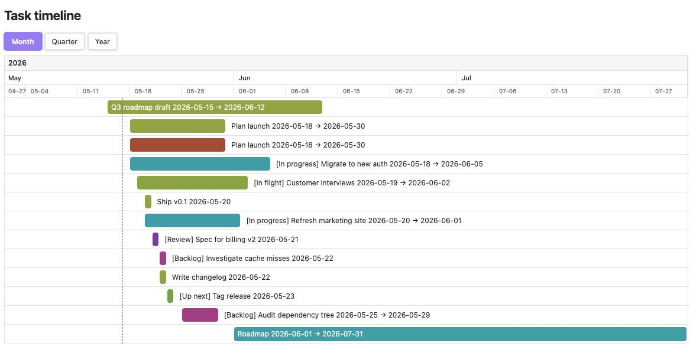

# Task Timeline

An Obsidian plugin that renders the Markdown tasks in your vault as a
horizontal, Gantt-style timeline. Each task becomes a bar on a date
axis, so you can see what's due, what overlaps, and what's coming up.



> Rendered from the sample notes in [`examples/`](./examples) — copy
> them into a vault to try the plugin against the exact data shown.

## Install

Not yet in the community plugin store. To install manually:

1. Download `main.js`, `styles.css`, and `manifest.json` from the
   latest release.
2. Copy them into `<your-vault>/.obsidian/plugins/obsidian-task-timeline/`.
3. In Obsidian, open **Settings → Community plugins**, reload the list,
   and enable **Task Timeline**.

## Open the view

Run the command **Task Timeline: Open view** from the command palette
(`Cmd/Ctrl + P`). The timeline opens in a new tab.

### Interacting with the timeline

- **Pan**: click-and-drag the timeline horizontally.
- **Zoom in/out**: hold `Ctrl` (or `Cmd` on macOS) and scroll the
  mouse wheel. The point under the cursor stays fixed.
- **Switch granularity**: use the **Month / Quarter / Year** buttons
  at the top.
- **Jump to source**: click a bar to open the file the task lives in
  (at the line of the task) — or for a linked-page task, the linked
  page itself.

The dashed vertical line marks today. The window is anchored to the
current month/quarter/year and spans a configurable number of periods
forward — earlier tasks pin to the left edge with a `‹` prefix, later
ones pin to the right edge with a `›` suffix.

## Writing tasks

Any Markdown checkbox with a date marker becomes a bar. Three marker
forms are recognized; pick whichever your other plugins already use.

```markdown
- [ ] Ship v0.1 (@2025-05-20)
- [ ] Plan launch 📅 2025-05-20
- [ ] Review PR @{2025-05-20}
```

### Date ranges

Two ISO dates joined by ` - ` (space-dash-space) inside the same
marker form a range. The first is the start, the second is the due
date.

```markdown
- [ ] Ship v0.1 (@2025-05-18 - 2025-05-25)
- [ ] Plan launch 📅 2025-05-17 - 2025-05-20
- [ ] Review PR @{2025-05-19 - 2025-05-21}
```

### Linked-page tasks

Instead of writing the title inline, you can point the checkbox at a
page. The page title becomes the bar label, and the dates come from
the page's frontmatter:

```markdown
- [ ] [[Plan launch]]
- [ ] [[Q3 roadmap|Roadmap]]
```

```markdown
---
start: 2025-05-15
due: 2025-05-20
---

Notes about the launch...
```

### Completed tasks

Done tasks (`[x]`) are hidden by default.

### Bar colors

Bars are colored deterministically:

- Tasks parsed from a `@{...}` (kanban) marker take their color from
  the most recent Markdown heading above them — useful for visually
  grouping kanban columns.
- Linked-page tasks are colored by the linked page.
- Everything else is colored by the file the task lives in.

Tasks under a kanban-style marker also get their heading shown as a
`[Column]` prefix on the bar label.

## Settings

Open **Settings → Task Timeline**.

- **Include folders / Exclude folders** — comma-separated paths.
  Leave include empty to scan the whole vault.
- **Default zoom** — granularity the view opens at.
- **Start of week** — Monday or Sunday; affects the week axis under
  the Month view.
- **Kanban → Ignore columns** — heading names whose tasks are hidden.
  Defaults to `Done`.
- **Window size per zoom** — how many months / quarters / years the
  timeline spans, starting at the current one. Defaults: 3 months
  (one quarter), 4 quarters, 10 years.
- **Day width per zoom** — pixels per day at each zoom level. Adjust
  if bars feel cramped or too spread out.

## Development

- `npm i` — install dependencies.
- `npm run dev` — build in watch mode.
- `npm run build` — produce a production bundle.
- `npm run lint` — run ESLint with the Obsidian plugin rules.
- `npm test` — run the Vitest unit tests.

Design notes live in [`.claude/spec.html`](./.claude/spec.html) (full
syntax reference: precedence between markers, mixed-body
fall-through, range validity rules).
